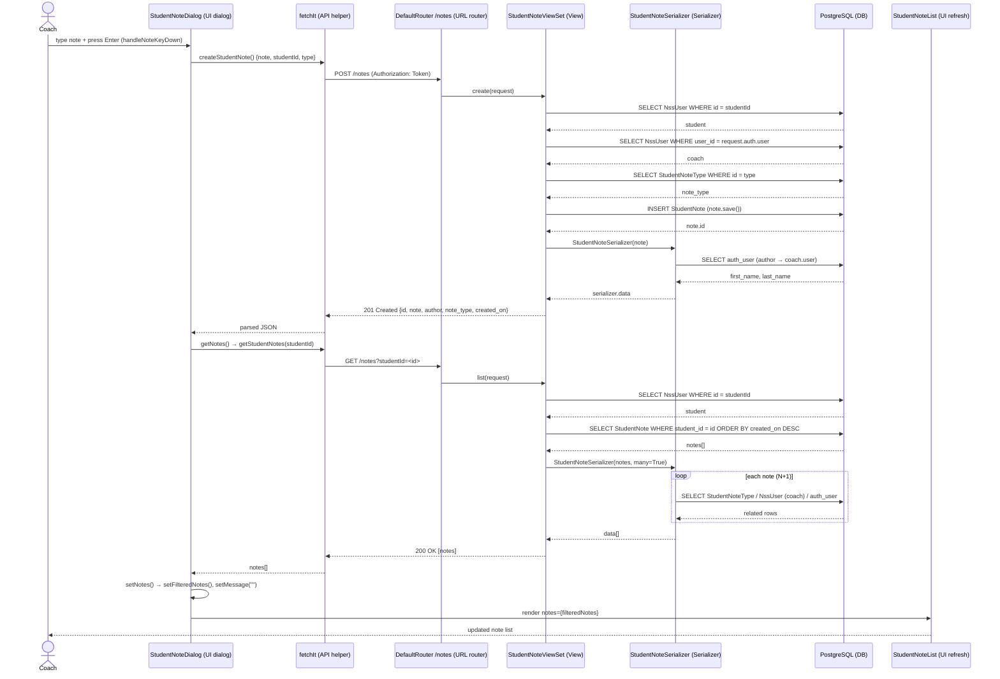

# Trace Notes (AI): notes (learn-ops-api)

Feature traced: **a coach creates a student note**. The coach types a note in the note dialog and presses Enter. The client sends `POST /notes`, then reloads the list with `GET /notes?studentId=<id>`.

### Request path table from Claude

| Layer | File | Class / Function | What it does |
|-------|------|-----------------|--------------|
| UI dialog | `learn-ops-client/src/components/dashboard/StudentNoteDialog.js:85` | `StudentNoteDialog` → `handleNoteKeyDown` → `createStudentNote` (line 40) | When the user presses Enter in the note input, it checks that a note type is selected and then calls `createStudentNote()`, which builds a JSON body `{ note, studentId, type }`. |
| API helper | `learn-ops-client/src/components/utils/Fetch.js:3` | `fetchIt` | Wraps `fetch`: adds the `Authorization: Token <token>` header from `simpleAuth`, sets `Content-Type: application/json` for POST, and parses the JSON response (or throws on `reason`/`message` errors). |
| URL router | `learn-ops-api/LearningPlatform/urls.py:37` | `router.register(r'notes', views.StudentNoteViewSet, 'note')` | The DRF `DefaultRouter` (with `trailing_slash=False`) maps `POST /notes` to `create` and `GET /notes` to `list` on the viewset. |
| View | `learn-ops-api/LearningAPI/views/student_note_view.py:34` | `StudentNoteViewSet.create` | Looks up the student and the coach (the logged-in user), validates `note` and `type`, builds a `StudentNote` and saves it, then returns 201 with the serialized note. |
| Serializer | `learn-ops-api/LearningAPI/views/student_note_view.py:77` | `StudentNoteSerializer` (nested `StudentNoteTypeSerializer`, line 72) | Output only: turns the note into `{id, note, author, note_type:{id,label}, created_on}`. It does **not** validate input; the view reads `request.data` by hand. |
| DB | `learn-ops-api/LearningAPI/models/people/student_note.py:5` | `StudentNote` model (FKs to `NssUser` ×2 and `StudentNoteType`) | Four queries: `NssUser.objects.get(pk=studentId)`, `NssUser.objects.get(user=request.auth.user)`, `StudentNoteType.objects.get(pk=type)`, and an `INSERT` from `note.save()`. The `author` property then reads `coach.user`, which adds one more query during serialization. |
| UI refresh | `learn-ops-client/src/components/people/PeopleProvider.js:48` → `StudentNoteDialog.js:36` → `StudentNoteList.js:7` | `getStudentNotes` → `getNotes` → `setNotes` → `StudentNoteList` | `.then(getNotes)` calls `GET /notes?studentId=<id>` (handled by `StudentNoteViewSet.list`, line 16). It stores the result in `notes` state, which is copied to `filteredNotes`, and `StudentNoteList` re-renders. The input is then cleared with `setMessage("")`. |

**Queries during the refresh (`list`, line 16):** `NssUser.objects.get(pk=studentId)`, then `StudentNote.objects.filter(student=student)`, ordered by `-created_on` (set by the model's `Meta.ordering`). For **each** note, the serializer lazily loads `note_type`, `coach` and `coach.user` (for `author`). That is an N+1 pattern of about 3 extra queries per note, because there is no `select_related`.

### Sequence Diagram

