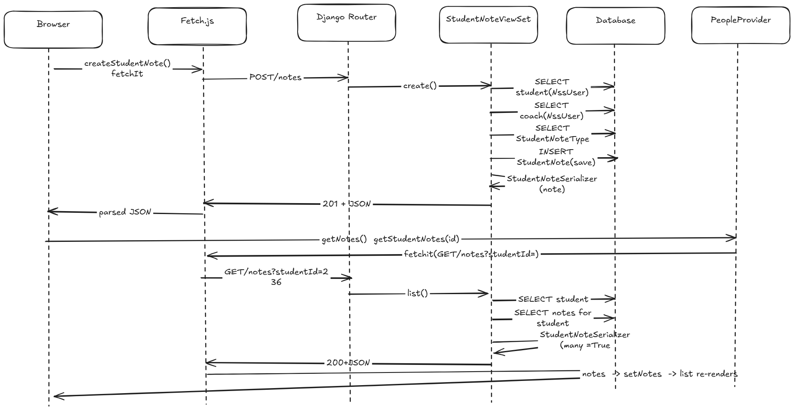

# Trace Notes - Create a Student Note

## Request Path

| Layer | File | Class / Function | What it does |
|-------|------|-----------------|--------------|
| UI dialog | learn-ops-client/src/components/dashboard/StudentNoteDialog.js | StudentNoteDialog, handleNoteKeyDown, createStudentNote | Renders the Learner Notes dialog. When Enter is pressed in the text box, handleNoteKeyDown calls createStudentNote, which builds the POST body ({note, studentId, type}). |
| API helper | learn-ops-client/src/components/utils/Fetch.js | fetchIt | Shared fetch wrapper. Adds the Authorization: Token header from the logged-in user, sets Content-Type to JSON for POST, calls fetch, and returns the parsed JSON for a 200/201 response. On an error response it throws an Error using the "reason" or "message" from the JSON. |
| URL router | learn-ops-api/LearningAPI/LearningPlatform/urls.py (line 37) | router.register(r'notes', views.StudentNoteViewSet, 'note') | The DRF router maps POST /notes to create() and GET /notes?studentId=... to list() on StudentNoteViewSet. |
| View | learn-ops-api/LearningAPI/views/student_note_view.py | StudentNoteViewSet.create() and list() | create() looks up the student, the coach (the logged-in user) and the note type, checks that note text and type were sent, saves a StudentNote, and returns it with a 201. list() reads the studentId query parameter, looks up the student, and returns all notes for that student. |
| Serializer | learn-ops-api/LearningAPI/views/student_note_view.py | StudentNoteSerializer (nests StudentNoteTypeSerializer) | Turns a StudentNote into JSON with id, note, author, note_type and created_on. author is a property on the model that returns the coach's first and last name. |
| DB | learn-ops-api/LearningAPI/models/people/student_note.py | StudentNote model | In create(), 3 reads happen before the save: NssUser by pk (student), NssUser by user (coach), StudentNoteType by pk. Then note.save() writes the row. list() reads the student, then filters StudentNote by student. Notes are ordered newest first. |
| UI refresh | StudentNoteDialog.js, PeopleProvider.js, StudentNoteList.js | getNotes, getStudentNotes, StudentNoteList | After the POST resolves, getNotes calls getStudentNotes, which sends GET /notes?studentId=... The result goes into setNotes, an effect copies it into filteredNotes, and StudentNoteList re-renders with the new note. Then the text box is cleared. |

## Sequence Diagram

[Excalidraw link](https://excalidraw.com/#...)

